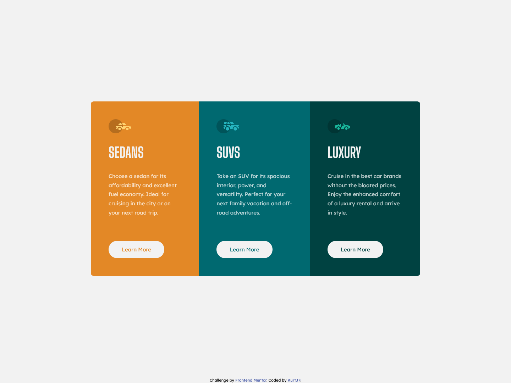

# Frontend Mentor - 3-column preview card component solution

This is a solution to the [3-column preview card component challenge on Frontend Mentor](https://www.frontendmentor.io/challenges/3column-preview-card-component-pH92eAR2-). Frontend Mentor challenges help you improve your coding skills by building realistic projects. 

## Table of contents

- [Overview](#overview)
  - [The challenge](#the-challenge)
  - [Screenshot](#screenshot)
  - [Links](#links)
- [My process](#my-process)
  - [Built with](#built-with)
  - [What I learned](#what-i-learned)
  - [Continued development](#continued-development)
- [Author](#author)

## Overview

### The challenge

Users should be able to:

- View the optimal layout depending on their device's screen size
- See hover states for interactive elements

### Screenshot



### Links

- Solution URL: [Frontend Mentor](https://www.frontendmentor.io/solutions/responsive-3-column-card-WBvJjHt3Pd)
- Live Site URL: [Github Pages](https://kurtjf.github.io/frontend-mentor/3column-card/)

## My process

### Built with

- Semantic HTML5 markup
- CSS custom properties
- Flexbox
- CSS Grid
- Mobile-first workflow

### What I learned

Sometimes the best solution to a problem is the simplest one. 

- Problem: the button was changing its size when the **hover** effect is being applied (since the hover is applying a 2px border outside the button)
- Solution: adding a 2 px border on the button (when not on hover) so it doesn't change size when hovering.

```css
button {
  font-family: "Lexend Deca", sans-serif;
  padding: 0.8rem 2.2rem;
  border: 2px solid var(--light-gray);
  border-radius: 2rem;
  background-color: var(--light-gray);
  font-size: 15px;
  margin-top: 1.5rem;
}

.button-one:hover {
  background-color: var(--bright-orange);
  border: 2px solid var(--light-gray);
  color: var(--light-gray);
}

.button-two:hover {
  background-color: var(--dark-cyan);
  border: 2px solid var(--light-gray);
  color: var(--light-gray);
}

.button-three:hover {
  background-color: var(--very-dark-cyan);
  border: 2px solid var(--light-gray);
  color: var(--light-gray);
}
```

### Continued development

- Learn more about media query and how to use it efficiently 

## Author

- Github - [KurtJF](https://github.com/KurtJF)
- Frontend Mentor - [@KurtJF](https://www.frontendmentor.io/profile/KurtJF)
