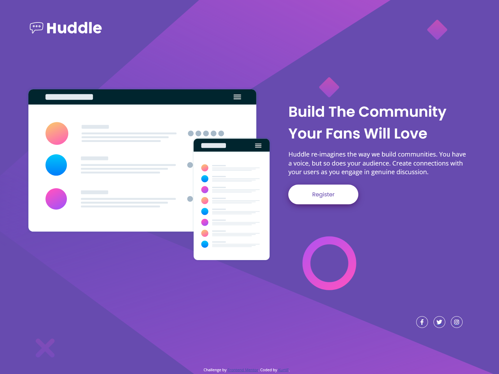

# Frontend Mentor - Huddle landing page with single introductory section solution

This is a solution to the [Huddle landing page with single introductory section challenge on Frontend Mentor](https://www.frontendmentor.io/challenges/huddle-landing-page-with-a-single-introductory-section-B_2Wvxgi0). Frontend Mentor challenges help you improve your coding skills by building realistic projects. 

## Table of contents

- [Overview](#overview)
  - [The challenge](#the-challenge)
  - [Screenshot](#screenshot)
  - [Links](#links)
- [My process](#my-process)
  - [Built with](#built-with)
  - [What I learned](#what-i-learned)
  - [Continued development](#continued-development)
- [Author](#author)

## Overview

### The challenge

Users should be able to:

- View the optimal layout for the page depending on their device's screen size
- See hover states for all interactive elements on the page

### Screenshot

### Links

- Solution URL: [Frontend Mentor](https://www.frontendmentor.io/solutions/responsive-huddle-landing-page-EnzEM03Pu2)
- Live Site URL: [Github Pages](https://kurtjf.github.io/frontend-mentor/huddle-landingpage/)

## My process

### Built with

- Semantic HTML5 markup
- CSS custom properties
- Flexbox
- Mobile-first workflow

### What I learned

- Learned how to include svg icons using [Fontawesome](https://fontawesome.com/) and [CSS-Tricks: Change color on hover)(https://css-tricks.com/change-color-of-svg-on-hover/)
- Tried to use container efficiently (need to think about

### Continued development

- Figure out how to structure HTML and CSS better for organization
- Need to work on optimizing css to prevent repetitive CSS declarations
- Research how to properly use aria-label / sr-only html for web accessibility functions
- Practice how to use containers

## Author

- Github - [KurtJF](https://github.com/KurtJF)
- Frontend Mentor - [@KurtJF](https://www.frontendmentor.io/profile/KurtJF)
