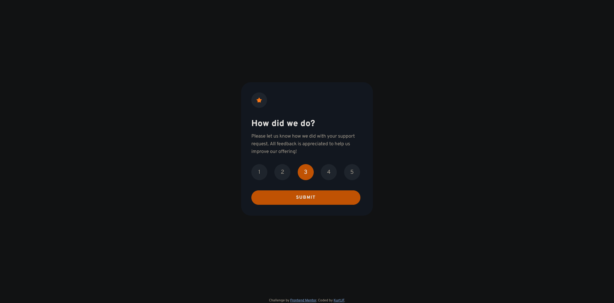
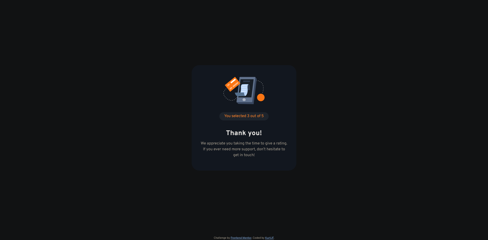

# Frontend Mentor - Interactive rating component solution

This is a solution to the [Interactive rating component challenge on Frontend Mentor](https://www.frontendmentor.io/challenges/interactive-rating-component-koxpeBUmI). Frontend Mentor challenges help you improve your coding skills by building realistic projects.

## Table of contents

- [Frontend Mentor - Interactive rating component solution](#frontend-mentor---interactive-rating-component-solution)
  - [Table of contents](#table-of-contents)
  - [Overview](#overview)
    - [The challenge](#the-challenge)
    - [Screenshot](#screenshot)
    - [Links](#links)
  - [My process](#my-process)
    - [Built with](#built-with)
    - [What I learned](#what-i-learned)
    - [Continued development](#continued-development)
  - [Author](#author)

**Note: Delete this note and update the table of contents based on what sections you keep.**

## Overview

### The challenge

Users should be able to:

- View the optimal layout for the app depending on their device's screen size
- See hover states for all interactive elements on the page
- Select and submit a number rating
- See the "Thank you" card state after submitting a rating

### Screenshot




### Links

- Solution URL: [Frontend Mentor](https://www.frontendmentor.io/solutions/interactive-rating-component-vUlYIzrnr4)
- Live Site URL: [Github Pages](https://kurtjf.github.io/frontend-mentor/interactive-rating/)

## My process

### Built with

- Semantic HTML5 markup
- CSS custom properties
- Flexbox
- Mobile-first workflow

### What I learned

First Frontend Mentor Challenge with Javascript that I did a few months ago.

---

Shows thankyou card after clicking submit

```js
submitBtn.addEventListener("click", () => {
  tyState.classList.remove("hidden");
  ratingState.style.display = "none";
});
```

Removes highlight when clicking another number

```js
btnNums.forEach((btnNum) => {
  btnNum.addEventListener("click", () => {
    btnNums.forEach((btn) => btn.classList.remove("clicked"));
    btnNum.classList.add("clicked");
    rating.textContent = btnNum.textContent;
  });
});
```

### Continued development

Still having trouble with problem solving in Javascript. Hoping to atleast be able to comfortably solve and make functions in the next coming months

## Author

- Github - [KurtJF](https://github.com/KurtJF)
- Frontend Mentor - [@KurtJF](https://www.frontendmentor.io/profile/KurtJF)
