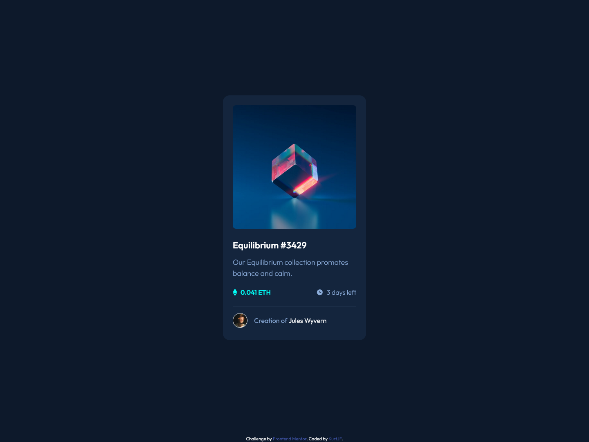

# Frontend Mentor - NFT preview card component solution

This is a solution to the [NFT preview card component challenge on Frontend Mentor](https://www.frontendmentor.io/challenges/nft-preview-card-component-SbdUL_w0U). Frontend Mentor challenges help you improve your coding skills by building realistic projects. 

## Table of contents

- [Overview](#overview)
  - [The challenge](#the-challenge)
  - [Screenshot](#screenshot)
  - [Links](#links)
- [My process](#my-process)
  - [Built with](#built-with)
  - [What I learned](#what-i-learned)
  - [Continued development](#continued-development)
  - [Useful resources](#useful-resources)
- [Author](#author)


## Overview

### The challenge

Users should be able to:

- View the optimal layout depending on their device's screen size
- See hover states for interactive elements

### Screenshot



### Links

- Solution URL: [Frontend Mentor](https://www.frontendmentor.io/solutions/responsive-nft-card-component--p7Kn3ldXg)
- Live Site URL: [Github Pages](https://kurtjf.github.io/frontend-mentor/nft-card/)

## My process

### Built with

- Semantic HTML5 markup
- CSS custom properties
- Flexbox
- Mobile-first workflow

### What I learned

Learned how to put an overlay on a picture when hovering. used **inset property and opacity** for the first time.

```html
<div class="img__container">
        
        <div class="hover-eye fade">
        
        </div>
</div>
```
```css
.img__container {
  height: auto;
  position: relative;
  overflow: hidden;
}

.hover-eye {
  display: flex;
  justify-content: center;
  align-items: center;
  position: absolute;
  inset: 0;
  background-color: var(--cyan-transparent);
  border-radius: 0.5rem;
}

.card__img {
  border-radius: 0.5rem;
}
```

### Continued development

I still need to work on

- CSS transitions
- CSS positions and when to properly use them
- Inset property and opacity (first time using it on this challenge)

### Useful resources

- [This helped me with the hover effect on the **card__img**](https://www.youtube.com/watch?v=tF3RE5CGt9U) 


## Author

- Github - [KurtJF](https://github.com/KurtJF)
- Frontend Mentor - [@KurtJF](https://www.frontendmentor.io/profile/KurtJF)

