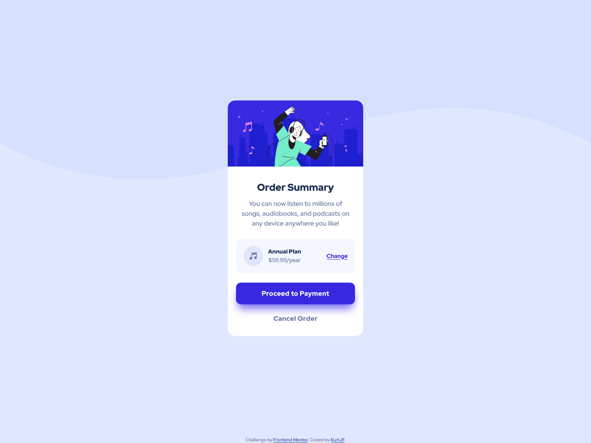

# Frontend Mentor - Order summary card solution

This is a solution to the [Order summary card challenge on Frontend Mentor](https://www.frontendmentor.io/challenges/order-summary-component-QlPmajDUj). Frontend Mentor challenges help you improve your coding skills by building realistic projects. 

## Table of contents

- [Overview](#overview)
  - [The challenge](#the-challenge)
  - [Screenshot](#screenshot)
  - [Links](#links)
- [My process](#my-process)
  - [Built with](#built-with)
  - [What I learned](#what-i-learned)
  - [Continued development](#continued-development)
- [Author](#author)

## Overview

### The challenge

Users should be able to:

- See hover states for interactive elements

### Screenshot



### Links

- Solution URL: [Frontend Mentor](https://www.frontendmentor.io/solutions/responsive-order-summary-component-D-e2w2sPyS)
- Live Site URL: [Github Pages](https://kurtjf.github.io/frontend-mentor/order-summary/)

## My process

### Built with

- Semantic HTML5 markup
- CSS custom properties
- Flexbox
- CSS Grid
- Mobile-first workflow

### What I learned

- width - fixed doesn't contract when screen scales down
- max-width -  contracts when the screen scales down
- remove **alt** for background images
- 1 **rem** = 16px (rem unit has value of the default font size (16px) 
*BUT* changing the font size on the main html tag also changes to value of rem.
  Ex. 
  Default font-size: 16px;
  font-size: 20px; = 1rem = 20px
  
To see how you can add code snippets, see below:

```css
 body {
    background-image: url(./images/pattern-background-mobile.svg);
    background-repeat: no-repeat;
    background-color: var(--pale-blue);
}

@media (min-width: 375px) {
  body {
    background-color: var(--pale-blue);
    background-image: url(./images/pattern-background-desktop.svg);
    background-repeat: repeat-x;
  }
}
```

### Continued development

- Learn how to use **rem** unit instead of **px**


## Author

- Github - [KurtJF](https://github.com/KurtJF)
- Frontend Mentor - [@KurtJF](https://www.frontendmentor.io/profile/KurtJF)
