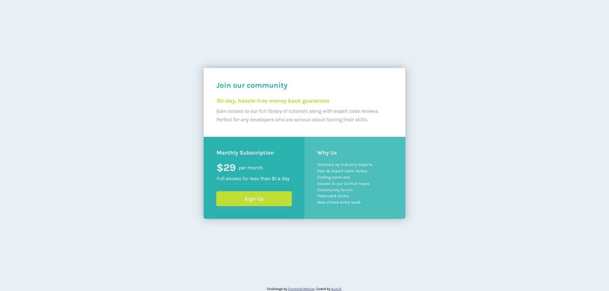

# Frontend Mentor - Single price grid component solution

This is a solution to the [Single price grid component challenge on Frontend Mentor](https://www.frontendmentor.io/challenges/single-price-grid-component-5ce41129d0ff452fec5abbbc). Frontend Mentor challenges help you improve your coding skills by building realistic projects.

## Table of contents

- [Overview](#overview)
  - [The challenge](#the-challenge)
  - [Screenshot](#screenshot)
  - [Links](#links)
- [My process](#my-process)
  - [Built with](#built-with)
  - [What I learned](#what-i-learned)
- [Author](#author)

**Note: Delete this note and update the table of contents based on what sections you keep.**

## Overview

### The challenge

Users should be able to:

- View the optimal layout for the component depending on their device's screen size
- See a hover state on desktop for the Sign Up call-to-action

### Screenshot




### Links

- Solution URL: [Frontend Mentor](https://www.frontendmentor.io/solutions/single-price-grid-component-iRGziuU_Jr)
- Live Site URL: [Github Pages](https://kurtjf.github.io/frontend-mentor/price-grid/)

## My process

### Built with

- Semantic HTML5 markup
- CSS custom properties
- Flexbox
- CSS Grid
- Mobile-first workflow

### What I learned

Used CSS Grid to make the desktop version of the challenge

```html
<div class="grid-one"></div>
<div class="wrapper">
  <div class="grid-two">grid two</div>
  <div class="grid-three">grid three</div>
</div>
```

```css
.wrapper {
  display: grid;
  grid-template-columns: 1fr 1fr;
}
```

## Author

- Github - [KurtJF](https://github.com/KurtJF)
- Frontend Mentor - [@KurtJF](https://www.frontendmentor.io/profile/KurtJF)
