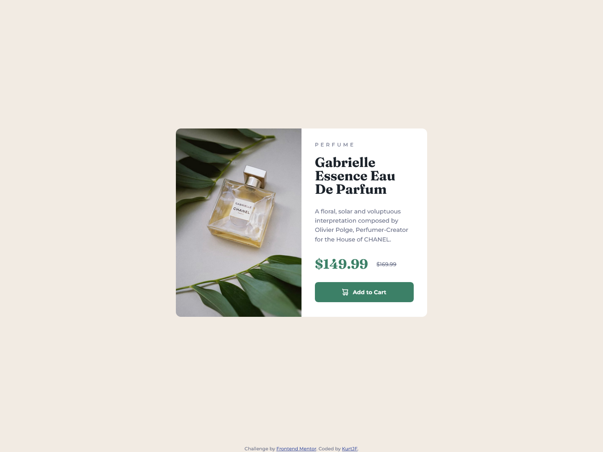

# Frontend Mentor - Product preview card component solution

This is a solution to the [Product preview card component challenge on Frontend Mentor](https://www.frontendmentor.io/challenges/product-preview-card-component-GO7UmttRfa). Frontend Mentor challenges help you improve your coding skills by building realistic projects. 

## Table of contents

- [Overview](#overview)
  - [The challenge](#the-challenge)
  - [Screenshot](#screenshot)
  - [Links](#links)
- [My process](#my-process)
  - [Built with](#built-with)
  - [What I learned](#what-i-learned)
  - [Continued development](#continued-development)
- [Author](#author)

## Overview

### The challenge

Users should be able to:

- View the optimal layout depending on their device's screen size
- See hover and focus states for interactive elements

### Screenshot



### Links

- Solution URL: [Frontend Mentor](https://www.frontendmentor.io/solutions/responsive-preview-card-component-jyCCSeroj_)
- Live Site URL: [Github Pages](https://kurtjf.github.io/frontend-mentor/product-preview/)

## My process

### Built with

- Semantic HTML5 markup
- CSS custom properties
- Flexbox
- CSS Grid
- Mobile-first workflow

### What I learned

- Learned how to transition from mobile image to desktop using **media query**

```html
 
 
```
```css
.image-mobile {
  border-radius: 12px 12px 0px 0px;
}

.image-desktop {
  display: none;
}

@media (min-width: 760px) {
.image-mobile {
    display: none;
  }

  .image-desktop {
    max-height: 450px;
    display: block;
    border-radius: 12px 0px 0px 12px;
  }
}
```

### Continued development

- Should've contained the  inside of a <div class="image__container">

## Author

- Github - [KurtJF](https://github.com/KurtJF)
- Frontend Mentor - [@KurtJF](https://www.frontendmentor.io/profile/KurtJF)
