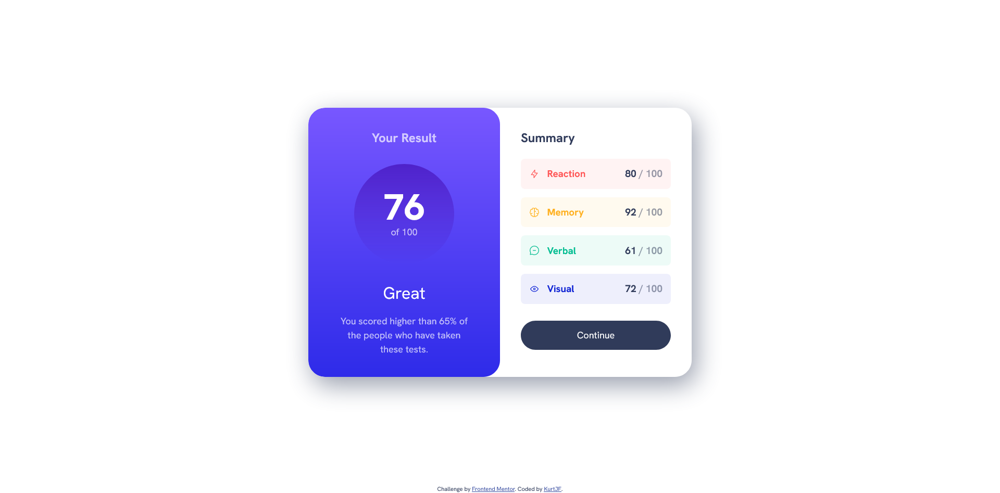
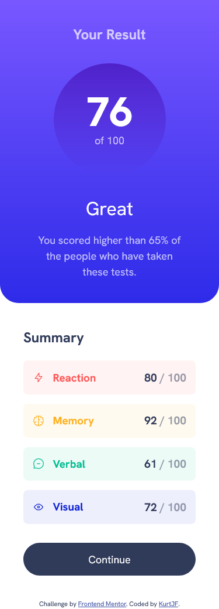

# Frontend Mentor - Results summary component solution

This is a solution to the [Results summary component challenge on Frontend Mentor](https://www.frontendmentor.io/challenges/results-summary-component-CE_K6s0maV). Frontend Mentor challenges help you improve your coding skills by building realistic projects.

## Table of contents

- [Frontend Mentor - Results summary component solution](#frontend-mentor---results-summary-component-solution)
  - [Table of contents](#table-of-contents)
  - [Overview](#overview)
    - [The challenge](#the-challenge)
    - [Screenshot](#screenshot)
    - [Links](#links)
  - [My process](#my-process)
    - [Built with](#built-with)
    - [What I learned](#what-i-learned)
    - [Useful resources](#useful-resources)
  - [Author](#author)

## Overview

### The challenge

Users should be able to:

- View the optimal layout for the interface depending on their device's screen size
- See hover and focus states for all interactive elements on the page
- **Bonus**: Use the local JSON data to dynamically populate the content

### Screenshot




### Links

- Solution URL: [Frontend Mentor](https://www.frontendmentor.io/solutions/results-summary-component-ASd74LqBBJ)
- Live Site URL: [Github Pages](https://kurtjf.github.io/frontend-mentor/results-summary/)

## My process

### Built with

- Semantic HTML5 markup
- CSS custom properties
- Flexbox
- CSS Grid
- Mobile-first workflow

### What I learned

Using data-attribute to target specific elements

```html
<section
  class="summary-container card grid-flow"
  data-spacing="large"
></section>
```

```css
.grid-flow[data-spacing="large"] {
  gap: 2rem;
}
```

```html
<div class="summary-item" data-item-color="yellow"></div>
```

```css
.summary-item[data-item-color="red"] {
  background-color: var(--transparent-red);
}
.summary-item[data-item-color="yellow"] {
  background-color: var(--transparent-yellow);
}
.summary-item[data-item-color="teal"] {
  background-color: var(--transparent-teal);
}
.summary-item[data-item-color="blue"] {
  background-color: var(--transparent-blue);
}
```

First time linking a local font file to css using @font-face

```css
@font-face {
  font-family: "HankenGrotesk";
  font-display: swap;
  font-weight: 100 500 700 800 900;
  src: url("./assets/fonts/HankenGrotesk-VariableFont_wght.ttf") format("truetype");
}
```

### Useful resources

- [HTML data-\*](https://developer.mozilla.org/en-US/docs/Web/HTML/Global_attributes/data-*)

  - Helped with targeting elements

- [Kevin Powell - Design to Code](https://www.youtube.com/watch?v=KqFAs5d3Yl8)
  - This helped me with learning how to use root efficiently and with CSS best practices in mind.

## Author

- Github - [KurtJF](https://github.com/KurtJF)
- Frontend Mentor - [@KurtJF](https://www.frontendmentor.io/profile/KurtJF)
